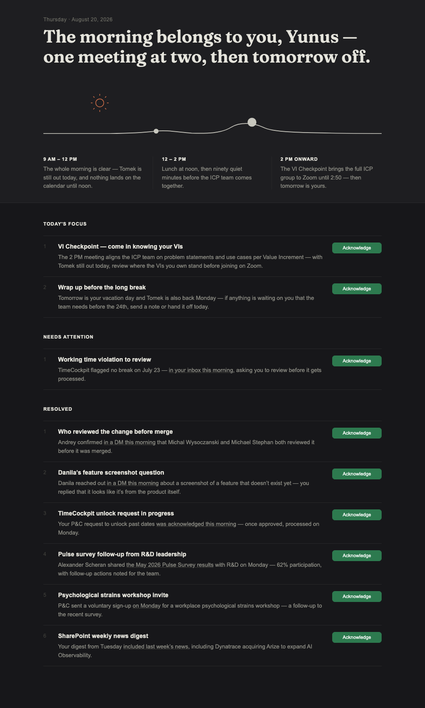

# Morning Brief

A native macOS app that shows your personalized morning brief — calendar, email highlights, Slack — as a styled dark-theme HTML page. Generated automatically each weekday at 8 AM by Claude Code.



## What you get

- **Today's focus** — prep for your main meeting of the day, and what to wrap up before tomorrow
- **Needs attention** — items with real cost if ignored today (someone blocked on you, a window closing)
- **Resolved** — threads that closed since yesterday, worth a glance
- **Acknowledge buttons** — green by default; click once to mark done (turns grey, locked — no revert); state persists across app restarts and carries unacknowledged items forward into the next day's brief

---

## Prerequisites

| Requirement | Notes |
|---|---|
| macOS 12 or later | Intel or Apple Silicon |
| Xcode Command Line Tools | Run `xcode-select --install` if missing |
| [Claude Code](https://claude.ai/code) | Desktop app or CLI |
| `anthropic-skills:morning` skill | Must be active in your Claude Code |
| Microsoft 365 connector | Outlook calendar + email access |
| Slack connector | Workspace access |

---

## 1 — Install the app

Open Terminal and run:

```bash
bash ~/path/to/install.sh
```

This compiles the Swift app (~60 s), generates the icon, and installs it to `~/Applications/Morning Brief.app`.

Then drag **Morning Brief** from `~/Applications` to your Dock.

**First launch only:** right-click the icon → **Open**, then click **Open** in the security dialog. After that, double-clicking works normally. (The app is unsigned, so macOS asks once.)

---

## 2 — Connect your data sources

In Claude Code, connect the two data sources if you haven't already:

1. Open **Settings → Connectors**
2. Add **Microsoft 365** — grant calendar and email access
3. Add **Slack** — grant workspace access

---

## 3 — Run your first brief

Open Claude Code and type:

```
/morning
```

Claude will pull today's calendar and recent inbox/Slack activity and render the brief. It also saves it to `~/Documents/MorningBrief/today.html`, which the app reads.

---

## 4 — Schedule it for 8 AM weekdays

Once the brief looks right, ask Claude to schedule it:

```
Set up the morning skill to run every weekday at 8 AM using Microsoft 365 and Slack connectors
```

Claude Code must be running (or set to launch at login) for the scheduled task to fire.

---

## How it works

```
Claude Code (8 AM, weekdays)
  └─ Reads: Outlook calendar + email, Slack mentions/DMs
  └─ Writes: ~/Documents/MorningBrief/today.html

Morning Brief.app
  └─ Opens: ~/Documents/MorningBrief/today.html in a WKWebView window
  └─ Writes: items-YYYY-MM-DD.json  (all items for carryover tracking)
  └─ Writes: acks-YYYY-MM-DD.json   (acknowledged IDs, keyed by date)

Next morning, Claude reads the last 3 weekdays' JSON pairs and prepends
any unacknowledged items to today's Needs Attention section.
```

The app shows a placeholder screen if no brief has been generated yet for today.

---

## Customising your brief

The brief filters to what's genuinely relevant to **you** — Jira tickets where you're assignee or mentioned, calendar events you organise or attend, Slack messages addressed to you. You can adjust what's included by editing the scheduled task prompt in Claude Code (`/schedule`).
